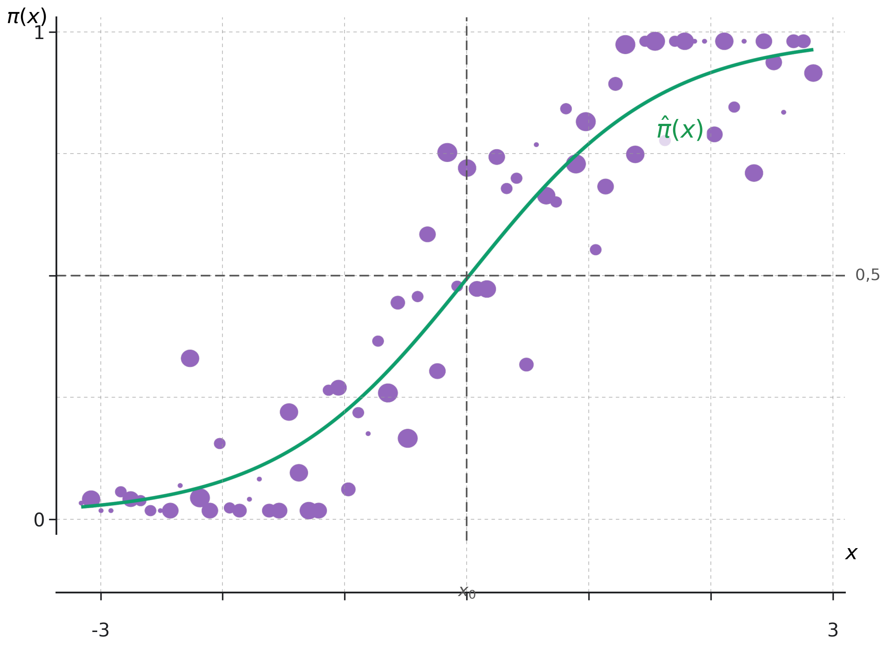

<h1 class="home-title">STT-4300</h1>

Régression II

Notes de cours, plan de cours et calendrier : régression linéaire, modèles linéaires généralisés, validation croisée, régularisation, méthodes non-paramétriques et modèles additifs généralisés.

<a class="home-action home-action--primary" href="notes/index.html">Notes de cours</a>
<a class="home-action home-action--secondary" href="calendrier.html">Calendrier</a>
<a class="home-action home-action--secondary" href="Projet/projet.html">Projet de session</a>

